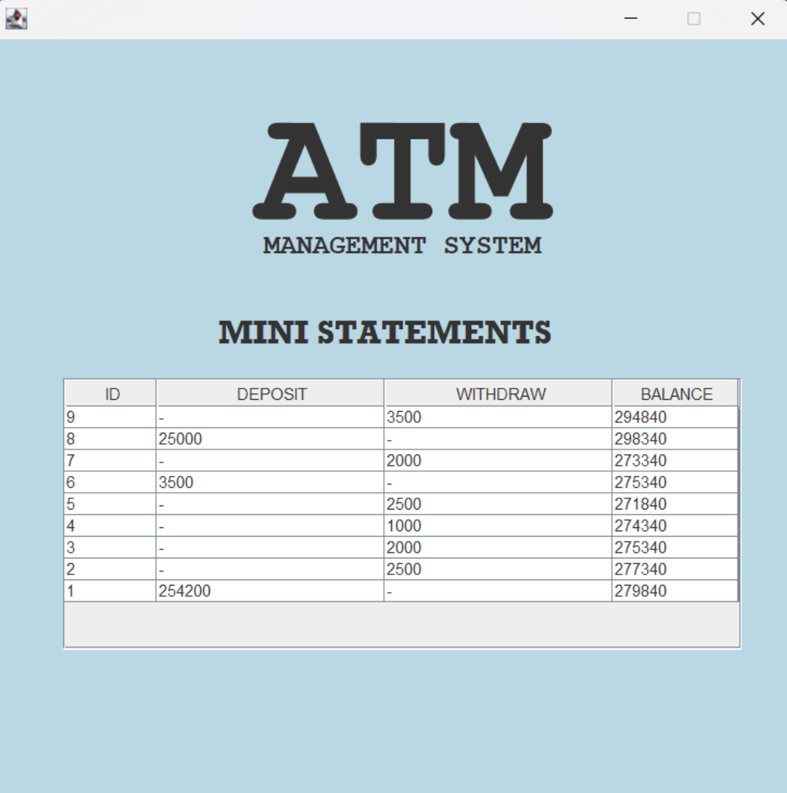

# ATM Simulation System with Database

## 📈 Project Overview

The **ATM Simulation System** is a Java-based project built using **Java Swing (GUI)** and **JDBC** for database integration.
It simulates the real-world functionalities of an ATM, including:

* User authentication (PIN validation)
* Balance enquiry
* Cash withdrawal & deposit
* Transaction history
* Exit functionality

This project is helpful for **students and beginners** learning Java, JDBC, and database connectivity.

---

## ⚙️ Tech Stack

* **Java (Swing / AWT)** – GUI development
* **JDBC API** – Database connectivity
* **MySQL / H2 Database** – Data storage
* **IntelliJ IDEA / Eclipse** – Recommended IDE
## 🚀 Setup Instructions

### 1. Clone Repository

```bash
git clone https://github.com/Anurag3244/ATM-Simulation-system-with-DB.git
cd ATM-Simulation-system-with-DB
```

### 2. Database Setup (MySQL)

Run the following SQL queries before starting the project:

```sql
CREATE DATABASE atm_system;
USE atm_system;

-- Table for storing user accounts
CREATE TABLE accounts (
    account_no INT PRIMARY KEY AUTO_INCREMENT,
    holder_name VARCHAR(100) NOT NULL,
    pin VARCHAR(10) NOT NULL,
    balance DECIMAL(10,2) DEFAULT 0.00
);

-- Insert sample accounts
INSERT INTO accounts (holder_name, pin, balance) VALUES
('Anurag Sharma', '1234', 10000.00),
('Rohan Kumar', '5678', 7500.00),
('Neha Verma', '4321', 5000.00);

-- Table for transaction history
CREATE TABLE transactions (
    txn_id INT PRIMARY KEY AUTO_INCREMENT,
    account_no INT,
    txn_type VARCHAR(20),
    amount DECIMAL(10,2),
    txn_date TIMESTAMP DEFAULT CURRENT_TIMESTAMP,
    FOREIGN KEY (account_no) REFERENCES accounts(account_no)
);
```

### 3. Update Database Config

In your Java project, update DB credentials in the `DBConnection.java` file:

```java
String url = "jdbc:mysql://localhost:3306/atm_system";
String user = "root";
String password = "your_password";
```

### 4. Run the Project

* Open project in IntelliJ/Eclipse
* Run the `Main.java` file
* Login using sample PINs (`1234`, `5678`, `4321`)

---

## 📸 Screenshots

(Add screenshots of login screen, balance enquiry, withdrawal, etc.)

| Feature         | Screenshot                               |
| --------------- | -------------------------------------    |
| Login Screen    |                       |
| Register        |                 |
| Failed Withdraw |  |
| Operations      |                |
| Statements      |           |

---

## 📝 Future Enhancements

* Admin panel to manage users
* ATM card simulation with account locking
* Improved UI with JavaFX
* Deploy on cloud with remote DB

---

## 🤝 Contributing

Pull requests are welcome! For major changes, please open an issue first to discuss what you’d like to change.

---

## 📄 License

This project is **open-source** under the MIT License.
